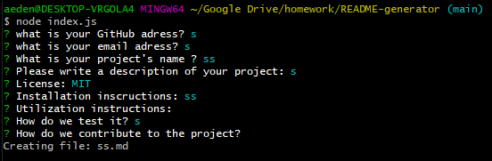

# README Generator
Project realized for UC Berkeley Extension Coding Bootcamp

[](https://opensource.org/licenses/MIT)



## Technology
 &nbsp;
 &nbsp;
 &nbsp;
 &nbsp;

- HTML
- CSS
- JavaScript
- [Node.js](https://nodejs.org/en/)
- npm packages:
    - [inquirer](https://www.npmjs.com/package/inquirer)

<br>
<hr>

## Summary 
This is a command-line application that generates styled readme Markdown files for different kinds of projects.
The user is asked to input several inputs listed below:

* GitHub adress
* Email Adress
* Project's name
* Description of the project
* Type of license (If any)
* Installation inscructions
* Utilization instructions:
* How to test it
* How to contribute

<br>
<hr>

## How to install
Download the project on your local machine.
Make sure you have node installed then at the root of the folder, run the command
```
npm install
```
<br>
<hr>

## How to use it
run the commande 
```
node index.js
```

<br>
<hr>

## Code 
```js
if(licenseLink){
licenseTxt = `
<a name="license"></a>
## License :
${licenseLink}
`;
```
In this example, I am show how I used Template literals to embed a variable inside a string.

<br>
<hr>

## Video Demo

[Link](https://drive.google.com/file/d/1RE9OOLVVlufw4FwKrB8I2N89NHVafr8Q/view)

<br>
<hr>

## Author
- [dylancouzon@gmail.com](mailto:dylancouzon@gmail.com)
- [GitHub](https://github.com/Dylancouzon)
- [LinkedIn](https://www.linkedin.com/in/dcouzon/)


